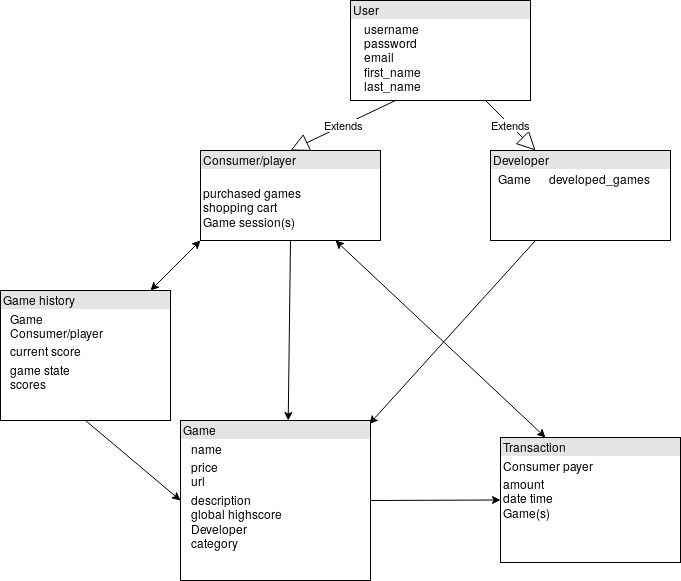

# Project plan

In this document, we describe our initial plans on how we are going to implement the features of our project, and what kind of views and models we will need. We also explain our ways of working and initial implementation schedule.

## Members of the team
* Eero Hiltunen 525352 
* Antonino Angi 784326
* Sara Cabodi 784287

## General description of feature to be implemented

In this section, we will describe the feature we are going to implement as well as how we are going to implement them. All of the features are listed with explanations.

We will implement all the mandatory features such as:
* *Register as a player and developer* - This will be implemented as a view that will add rows/objects to the database. There will be separate tables for developers and players.
* *As a developer: add games to their inventory, see list of game sales* - There will be a table for games and each developer object will have list of their games. The games objects will store the selling history which allows us to show list of game sales for a given developer. This functionality will be limited to only developer type of users.
* *As a player: buy games, play games, see game high scores and record their score to it* - There will be a view for searching for games, which allows users to buy the games through the mock payment app. The purchased games will be stored in the player object that determines which games a player is allowed to play. The game url will be stored in the game object. Each game the user starts the first time will initialize a Game history object that will host all the personalized information related to the game. This table will store the game state and records for the user. This way the scores of a player will be store permanently and we can access them later on to show them to the user.

* *Authentication* - A player or developer can login, logout and register using Django authentication system. This will be implemented as a form in which to insert username and password. To register, the user is also requested to insert an email: an email validation is also supported by the system. Some 3rd part packages are included to support *Password strength checking*. 

* *Basic player functionalities* - A player, once properly logged in, will be allowed to *buy* new games, *play* one of the purchased ones and, optionally, *save* their status. 
The purchase of new games will be done throught the course’s mockup payment service and the player will be able to search for games in the specific view ("Game catalogue"). 
The payer, after at least one purchase, will be allowed to choose between its games through a table available after the login, play a new session or resume an older one. 
For each purchased game, the player will also have access to the history of his previous scores (only for the finished sessions) and he will be able to look at the global top3 scores for that specific game in the game view.
In order to resume an on-going session, the palyer will have to press the "SAVE" button, so that the current score and infos will be stored in the Game history object.

* *Basic developer functionalities* - A developer, after logging in, will be allowed to *add* a game, throught its URL, to the system, *set price* for that game and *manage* that game (remove, modify).
The developer will use the "Manage game" view to do all the actions mentioned before. In case of removal or modification of a game, all the players will be notified with a message and, just for the removal, 
the game won't be available anymore  in the catalogue, but it will still be accessible for the players who already purchased it. 
A basic game inventory will be available at the "Game cataloge" view and some sales statistics will be computed for the developer. The latter will be computed and shown just on demand, through a specific button available to the developer after the login.

* *Game/service interaction* - When the player presses the submit score, the game automatically sends a postMessage to the parent window using the message framework provided by Django, which is also used to save the new score to the global high score list for that game.

In addition, we will implement the following extra features:
* *3rd party login* - Since the authentication system in Django is very generic and doesn’t provide some features commonly found in web authentication system, we will implement 3rd part features to allow the user to access to the system using his OpenID, Gmail or Facebook credentials.
* *RESTful API* - We will utilize Django REST Framework to implement a RESTful API for our website. It will have its own app and the url will start with /api/. The API could show for example available games, high scores and sale statistics.
* *Own games* - We will develop our own simple game that can communicate with the sercice. The game could be something like "Flappy bird".
* *Social media sharing* -  We will develop this possibility both for logged-in users and non logged-in ones. The game will have its url, name, description and an image representing the logo of the website to be posted on social media (Facebook, Twitter).

## Models and views

* Initial ideas of what kinds of views and models are needed, how they relate to each other. Pay attention to the models - the better the initial guess, the faster you get to implement things as changes to models briefly interrupt the whole team. Give an initial draft of what models you plan to have and what fields those models have. Note that Django already has a user model.

### Models

We drafted a plan of the database scheme which consists of the Django models. The goal was to plan the scheme in a way that allows simple extensibility and modification.

 At this points, we plan to have six different models: User, Player, Developer, Game History, Game, and Transaction. Player and Developer inherit from User so that they can have unique features separate from each other. The Game model contains the "static" data related to the games whereas Game history stores the Player-specific information related to specific games and game sessions. This allows storing game state and scores.

The Transaction model is utilized for transactions of the games. It will be linked to the mock payment service and facilitate the purchasing of the games.

Please, see the database scheme from below.

### Views
Here are the initial Views that we plan to implement and the models that are related to them inside brackets.

* Login (User, Consumer, Developer)
* Register (User, Consumer, Developer)
* Index (Game, Consumer)
* Manage game (Developer, Game) - view that allows the developer to add, modify or delete a game from the system
* Game description (Game)
* Game session (Game history)
* Game cataloge (Game)
* Game statistics (Game, Developer)
* Payment (Transaction, Consumer, Game)

## Ways of working

We will be working both together and individually. This means that we are going to have weekly meetings but most of the actual implementation will be done individually.

In the meetings, we will agree on the next individual tasks for each group member, discuss on-going problems and collaborate on the project. These regular meetings will help us bring problems visible early and solve them before they escalate.

We will be using Telegram for communication and version.aalto.fi for version control and project management. We decided to use these tools because each group member had had good experiences with them.

## Implementation order and timetable.

1. Backend and deployment(20.12.2019-1.2.2020)
    * Heroku deployment
    * Models
    * Views
    * URLS
2. HTML, Javascript and CSS (1.1.-1.2.2020)
    * Backend-frontend integration
    * Page formatting
    * User experience
4. Additional features (1.2.-14.2.2020)
5. Testing (1.2.-14.2.2020)
6. Documentation (1.2.-14.2.2020)
7. Final submission (14.2.2020)

# Final Submission

* Eero Hiltunen 525352 
* Antonino Angi 784326
* Sara Cabodi 784287

## Implemented Features and self-grading

* *Minimum functional requirements*  
    We implemented all the minimum functionalities. Registering as a player or developer is possible. Developer can add games and see list of added games. Player can buy games, play them and see personal and global highscores.

* *Authentication*   
    Our website supports player and developer login, logout and registering. Email validation is sent to the Django Console Backend when a new user signs up.  
    We implemented the required functionalities completely so we suggest 200/200 points for this section.

* *Basic player functionalities*  
    Player can buy games from our website and the payments are handeld with the provided mockup payment service. Player can also play these games online. 
    Player cannot play games that they've purchased. Player can find games from the website via search functionality, categories, and listing of the game title.  
    We considered all the functionalities in this section and therefore we suggest full 300/300 points for it.

* *Basic developer functionalities*  
    On our website, developer can add games with an url and set price for the game. These games then shown on the website. The developer can also modify the game info or remove the game completely from the website.  
    Developer can see the games they added and the sales statistics for each game. The sales statistics include number of sold games and when they have been sold.  
    We considered the security restrictions which means that the developeros cannot for example modify or remove games they haven't added themselves. Also, developer can also add games only to their own inventory.  
    We implemented all the required functionalities and therefore suggest 200/200 points for this section.

* *Game/service interaction*  
    We implemented the score submission and the score is stored in the web service database. These scores are shown to the players. The service can send games to the service (e.g. error message).  
    We developed all the funcitionalities in this section and therfore suggest full 200/200 points for it.

* *Quality of Work*  
    Quality of code is of high level. All of the HTML and Javascript files were validated as instructed. In addition, we used sensible variables and commented most curcial functions. We also utilized the Django framework in a purposefull manner. We didn't repeat program codes uselessly, and we considered Model-View-Template in our design choices.
    The front-end of the page was polished with Bootstrap 4 which makes user-experience great. The usability is also top-of-the-line.
    We carried out extensive unit testing as well as integration and system testing. We have 36 unit tests that ensure that no simple bugs exist in the source code. In other parts of the testing, we made sure that the software fullfilled the project requirements and was overall usable without any bugs.
    For the security part, we checked all the possible issues, in particular:
    + Cross site request forgery (CSRF) protection -> we used the csrf_token inside every POST form;
    + SQL injection protection -> Django's queryset are protected from SQL injections;
    + Admin page protection -> we changed the default admin URL from /admin/ to /secret_admin/ using django-admin-honeypot which capture attempts to hack the site.
    
    Other security issues were checked with the ZAP (OWASP Zed Attack Proxy) tool which allows to do many attacks to the website showing all the security problems.
    We paid close attention to the quality of work and therefore suggest 100/100 points for this section.

* *Non-functional requirements*  
    Our project plan and final report have been carefully drafted with fine details. Our teamwork functioned well and we utilized the project management features of Git extensively.  
    We suggest full points 200/200 for this section.

* *Save/load and resolution feature*  
    Our service support both saving and loading of game sessions with simple message protocol. The state of the game is saved to the database and it is accessible for loading.  
    We implemented this functionality completely and therefore suggest full score of 100/100 for this section.
    
* *3rd party login*  
    We allow user to login with Gmail or Facebook account to our web page. These users are asked the type of their account and all same functionalities work for them as for normal accounts.
    The functionalities of this section work perfectly and therefore we suggest full 100/100 points for it.

* *Own game*  
    We developed a simple game in Javascript that is hosted on a Heroku deployment. In this game, player tries to avoid AI that is chasing them. Avoiding the AI results to higher scores.  
    The game works and is fun to play. Therefore we suggest full 100/100 points for this section.

* *Mobile Friendly*  
    Usability of the website is great both on traditional computers and mobile devices. We achieved this by utilizing the features of Bootstrap 4. For example, we have a menu that collapses to a hamburger menu when the site is used with a mobile device.  
    The requirements are fulfilled completely and therefore we suggest 50/50 points for this section.

* *Social media sharing*
    A player or developer can share purchased games using the most famous and used social networks such as Facebook, Twitter, LinkedIn and Google+. The main problem with this section was that Google+ has been closed and it is no longer usable, however we left it for completeness. We used metadata to advertised well the shared game which shows the description to the game and the image. 
    If a non logged-in user accesses to the link shared by somebody else, he sees the game page with a brief description of the game.
    The sharing works perfectly and therefore we suggest full 50/50 points for this section.

## Successes and Problems  

We were successful in creating a website that fulfills the minimum requirements and most of the extra-features (5/6). Many tests have been written to check most of the features related to the games, purchasing process and the login/signup.
A problem showed up when trying to share our games with Google+ because the social network has been closed.
Other problems were solved after re-reading the slides carefully.

## Division of work

* **Authentication** -> Antonino Angi

* **Basic player functionalities** -> Sara Cabodi, Eero Hiltunen

* **Basic developer functionalities** -> Sara Cabodi, Eero Hiltunen

* **Game/service interaction** -> Eero Hiltunen

* **Quality of Work** -> Antonino Angi, Sara Cabodi, Eero Hiltunen

* **Non-functional requirements** -> Antonino Angi, Sara Cabodi, Eero Hiltunen

* **Save/load and resolution feature** -> Eero Hiltunen

* **3rd party login** -> Antonino Angi

* **Own game** -> Eero Hiltunen

* **Mobile Friendly** -> Sara Cabodi, Eero Hiltunen

* **Social media sharing** -> Antonino Angi, Eero Hiltunen

## Instructions
The homepage is https://webshopdjango.herokuapp.com 

* If a user is not logged-in, he just sees a window that invites him to login or sign-up. He can freely browse the Catalogue and Categories and, if he clicks on a game, he sees the game name, the category the game belongs to, the description and the price.

* A user can sign-up inserting Username, First Name, Last Name, Email, Password and then deciding which user he wants to be, if a player or developer. After that, a message with a link is sent to his email (the console) for confirmation.

* A user can login in two ways:
    + Using his credentials in social networks such as Facebook and Google;
    + Using the username and password inserted during the sign-up phase.
 

* If a user is logged-in as a player, he can browse all the games and buy new ones. He can play the games already bought and for those games a window with the highest-points is shown. He could also share those games with his friends using Facebook, Twitter, LinkedIn and Google+. Lastly, if he clicks on the user icon he can revise his user information and a list of his purchased games.

* If a user is logged-in as a developer, he can add a new game, set its price, he can also modify or delete his games. He sees his games inventory and the statistics of the games he added and sold (how many times and if he clicks on it a list of dates will be displayed).

NOTE: We decided that a developer can choose to remove his game from the website. Since each game is online, we couldn't garantee that older versions would be available for each user. Therefore, when a game is removed, every player in possession of that game won't be able to play it anymore. 
Ideally, if this would be a true webservice with real money and users' wallets, we would try to guarantee the possibility to play with older versions of the game or somehow reward the players that had purchased it.

